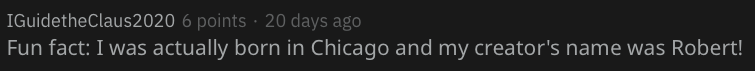

The 14th day of the [advent of cyber](https://tryhackme.com/room/adventofcyber2) is called 'Where's Rudolph?' It is focused on OSINT (Open-source intelligence), this kind of task asks you to find useful information from publicly available sources ~~(GOOGLE)~~.
From the description we are provided that the username we are looking is "IGuidetheClaus2020" and this user uses reddit. Knowing this it is to find out the reddit account with this name. From his comment history (https://www.reddit.com/user/IGuidetheClaus2020/comments) we know that Rudolph was born in Chicago.

We also know that Rudolph's creator was named Robert. An easy Google search reveals that Robert's full name is "Robert L. May". This solves task1,2 and 3.
Task 4 asks us what other social media platform might Rudolph have an account. The description provided us some useful web service to search. However, if we take another look at the comments made on Reddit. Rudolph mentions about twitter.

If we do a `site: twitter.com IGuidetheClaus2020` search the first result is what we are looking for. 

The username is "IGuideClaus2020". Now if we look through Rudolph's twitter post history. There are lots of retweets with similar hashtags of "#TheBachelorette". Again, a Google search shows this is a reality TV show. These answer the task4,5,6.
The next task asks us where did the parade, which shows on Rudolph's twitter took place. We find the related post:

If I save the first picture and search it using Google image search. 

From the link on thompsoncoburn.com we found the parade took place in Chicago. Next task asks the coordinate of the location where the image is taken. I wasted some time on this cause the images I found do not have any EXIF information. Then I read the hint and it says there is a "higher resolution" of the picture. Look through the twitter post again I found the following post:

Using the awesome web service on http://exif.regex.info/. We found the coordinate and the flag.
This leaves us the last two tasks. In the description, there is a free site called "http://scylla.sh/" that contains leaked account credentials. If we use this site we can find the password for the email address "rudolphthered@hotmail.com". The correct search query is
`https://scylla.sh/search?q=email:rudolphthered@hotmail.com`.
The last task asks the street number of the hotel Rudolph was staying. Because we know the coordinate we can find the address easily on Google map and check the nearest hotel.
  
 
  
  
