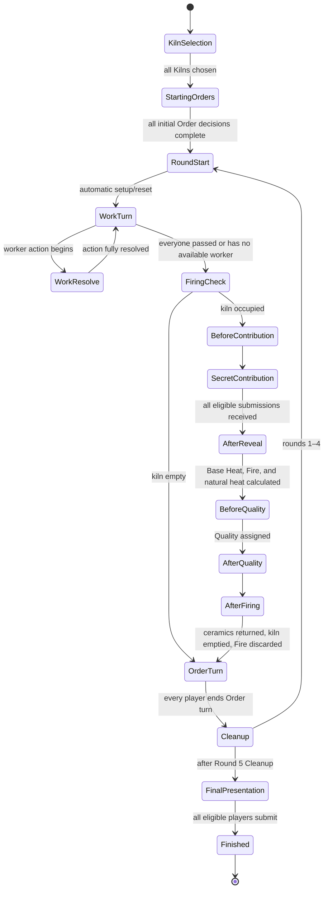

# ENGINEERING_DESIGN_REVIEW.md — Kiln Opening V0.6.3

> **Historical archive only.** This review records the V0.6.3 engine-design checkpoint and
> must not be used as a current rules source. The sole current source is
> `docs/KILN_OPENING_v1.1.6_SOURCE.md`; current implementation rulings are in
> `docs/IMPLEMENTATION_DECISIONS.md`.

## Scope and authority

This is an engineering design review only. It does not implement the game and does not change any gameplay value.

At the time of this archived review, source precedence followed the then-current `AGENTS.md`. Those old values are preserved below only as design history. Raster assets were not rules sources. The proposed engine was server-authoritative, deterministic except for injected shuffle randomness, JSON-serialisable, and independent of React, networking, Supabase, and browser APIs.

### Handoff gate and structured-data reconciliation

`python3 tools/validate_handoff.py` passed before design work began.

No gameplay mismatch was found between `data/*.json` and `GAME_RULES.md`.

| Structured source | Reconciled result |
|---|---|
| `game_config.json` | 2–4 players, 5 rounds, starting resources, workforce, unlock spaces, displays, hand limits, Shape costs/supply, Glazes, Decorations, kiln, Fire distribution, Progress VP, Seal, and Coin scoring match. |
| `action_locations.json` | Exactly six locations; all 2P/3P/4P capacities and Apprentice/Shifu effects match. No obsolete Shifu repositioning appears. |
| `round_structure.json` | The five phases and their order match. |
| `firing.json` | Eight spaces, zone modifiers, contribution values, contributor-scaled Base Heat, Fire distribution, and Quality mapping match. |
| `imperial_progress.json` | Track rewards/VP, per-Imperial-Order advancement, Presentation eligibility/scoring, and no-punishment rule match. |
| `kilns.json` | All five current Kiln Traditions and their effects match. |
| `techniques.json` | IDs T01–T12, four tiles per discipline, costs, names, once-per-round flags, and exact effects agree with the rule file's delegated Technique definitions. |
| `orders.json` | IDs M01–M20 and I01–I10, counts, requirement vocabulary, rewards, and Qualities agree with the rule file's delegated Order definitions and the historical V0.4 handoff audit. |
| `components.json` | Component counts are consistent with all rule-constrained quantities. |
| `asset_specs.json` | Regeneration requirements reflect the current six-location, no-Refined-Clay, contributor-scaled V0.6.3 rules and obsolete Order-card sheets. |

The procedural ambiguities that still require a ruling are isolated in section 7. They are not structured-data mismatches.

## 1. Proposed TypeScript domain model

### 1.1 Model boundaries

Use three distinct model layers:

1. **Rules content** — immutable, validated definitions loaded from `data/*.json` and addressed by stable IDs.
2. **Runtime game state** — the authoritative JSON-serialisable state consumed by the pure engine.
3. **Transport projections** — public and player-private DTOs derived from runtime state; never use a transport DTO as engine state.

Do not parse prose ability strings at runtime. A typed rules registry keyed by stable IDs should implement Order relations, Technique effects, Kiln effects, and location effects. At startup and in CI, validate that every structured-data ID has exactly one typed implementation and that no implementation refers to an absent ID.

### 1.2 IDs and scalar types

```ts
type Brand<T, B extends string> = T & { readonly __brand: B };

type GameId = Brand<string, "GameId">;
type PlayerId = Brand<string, "PlayerId">;
type WorkerId = Brand<string, "WorkerId">;
type CeramicId = Brand<string, "CeramicId">;
type VesselInstanceId = Brand<string, "VesselInstanceId">;
type OrderId = Brand<string, "OrderId">;
type TechniqueId = Brand<string, "TechniqueId">;
type KilnId = Brand<string, "KilnId">;
type LocationId = Brand<string, "LocationId">;
type KilnSpaceId = Brand<string, "KilnSpaceId">;
type CommandId = Brand<string, "CommandId">;

type PlayerCount = 2 | 3 | 4;
type RoundNumber = 1 | 2 | 3 | 4 | 5;
type Contribution = 0 | 1 | 2 | 3;
type FireModifier = -2 | -1 | 0 | 1 | 2;
type WorkerKind = "shifu" | "apprentice";
type Shape = "bowl" | "plate" | "washer" | "vase" | "censer";
type Glaze = "white" | "celadon" | "grey_green" | "moon_white";
type Decoration = "plain" | "carved" | "impressed" | "crackle";
type Quality = "flawed" | "standard" | "fine" | "masterpiece";
type TechniqueDiscipline = "forming" | "glazing" | "firing";
```

IDs must not be array positions. Runtime-created IDs, including `CeramicId`, should be deterministic from game ID plus an engine sequence, not timestamps or random UUID calls inside the reducer.

### 1.3 Immutable rules content

```ts
interface RulesContent {
  readonly rulesVersion: "0.6.3";
  readonly contentHash: string;
  readonly config: GameConfigDefinition;
  readonly locations: Readonly<Record<LocationId, LocationDefinition>>;
  readonly orders: Readonly<Record<OrderId, OrderDefinition>>;
  readonly techniques: Readonly<Record<TechniqueId, TechniqueDefinition>>;
  readonly kilns: Readonly<Record<KilnId, KilnDefinition>>;
  readonly kilnSpaces: Readonly<Record<KilnSpaceId, KilnSpaceDefinition>>;
  readonly imperialProgress: ImperialProgressDefinition;
}

interface OrderDefinition {
  readonly id: OrderId;
  readonly deck: "market" | "imperial";
  readonly slots: readonly OrderRequirementSlot[];
  readonly relations: readonly OrderRelation[];
  readonly minimumQuality: Quality;
  readonly vp: number;
  readonly coins: number;
  readonly imperialProgressReward?: 1 | 2;
}

interface OrderRequirementSlot {
  readonly shape?: Shape;
  readonly glaze?: Glaze;
  readonly decoration?: Decoration;
}

type OrderRelation =
  | { readonly type: "same_glaze"; readonly indices: readonly number[] }
  | { readonly type: "different_glaze"; readonly indices: readonly number[] }
  | { readonly type: "all_different_glaze"; readonly indices: readonly number[] }
  | { readonly type: "different_shape"; readonly indices: readonly number[] }
  | { readonly type: "all_different_shape"; readonly indices: readonly number[] }
  | { readonly type: "same_decoration"; readonly indices: readonly number[] }
  | { readonly type: "at_least_n_quality"; readonly quality: Quality; readonly count: number };
```

Order matching must search valid permutations of selected ceramics against requirement slots. Selection order from the UI must never affect legality.

### 1.4 Runtime game state

```ts
interface GameState {
  readonly schemaVersion: 1;
  readonly rulesVersion: "0.6.3";
  readonly contentHash: string;
  readonly gameId: GameId;
  readonly revision: number;
  readonly nextEntitySequence: number;
  readonly eventSequence: number;

  readonly status: "setup" | "playing" | "final_presentation" | "finished";
  readonly playerOrder: readonly PlayerId[];
  readonly firstPlayerId: PlayerId;
  readonly round: RoundNumber;
  readonly flow: FlowState;

  readonly players: Readonly<Record<PlayerId, PlayerState>>;
  readonly ceramics: Readonly<Record<CeramicId, CeramicState>>;
  readonly commonSupply: { readonly clay: number; readonly wood: number; readonly coins: number };
  readonly vesselSupply: Readonly<Record<Shape, readonly VesselInstanceId[]>>;
  readonly actionBoard: ActionBoardState;
  readonly decks: DeckCollectionState;
  readonly displays: DisplayState;
  readonly firing?: FiringContext;
  readonly imperialSealOwnerId?: PlayerId;
  readonly finalResult?: FinalResult;
}

interface PlayerState {
  readonly id: PlayerId;
  readonly seatIndex: number;
  readonly displayName: string;
  readonly kilnId?: KilnId;
  readonly resources: { readonly clay: number; readonly wood: number; readonly coins: number };
  readonly workers: Readonly<Record<WorkerId, WorkerState>>;
  readonly orderHand: readonly OrderId[]; // public in V0.6.3
  readonly completedOrders: readonly CompletedOrder[];
  readonly techniques: Readonly<Record<TechniqueId, OwnedTechniqueState>>;
  readonly imperialProgress: 0 | 1 | 2 | 3 | 4 | 5;
  readonly score: ScoreLedger;
  readonly roundFlags: PlayerRoundFlags;
}

type WorkerState =
  | { readonly kind: "shifu"; readonly status: "available" | "placed"; readonly locationId?: LocationId }
  | { readonly kind: "apprentice"; readonly status: "locked" | "available" | "placed"; readonly locationId?: LocationId };

interface PlayerRoundFlags {
  readonly passedWorkPhase: boolean;
  readonly pendingUnlocks: 0 | 1 | 2;
  readonly kilnAbilityUsed: boolean;
}

interface OwnedTechniqueState {
  readonly id: TechniqueId;
  readonly exhausted: boolean;
}
```

`pendingUnlocks` records reaching Progress 2 or 4 during the round; Cleanup changes each corresponding locked Apprentice to available. Multiple Imperial completions may leave both unlocks pending before Cleanup.

### 1.5 Ceramic lifecycle

Use a discriminated union so illegal attribute combinations are unrepresentable. A Vessel instance is the finite physical supply item; a Ceramic instance is one use of that Vessel. Selling a Flawed ceramic retires the Ceramic and returns its Vessel instance to supply.

```ts
interface CeramicCore {
  readonly id: CeramicId;
  readonly vesselInstanceId: VesselInstanceId;
  readonly ownerId: PlayerId;
  readonly shape: Shape;
}

type CeramicState =
  | (CeramicCore & { readonly stage: "shaped" })
  | (CeramicCore & {
      readonly stage: "glazed";
      readonly glaze: Glaze;
      readonly decoration: Decoration;
    })
  | (CeramicCore & {
      readonly stage: "loaded";
      readonly glaze: Glaze;
      readonly decoration: Decoration;
      readonly kilnSpaceId: KilnSpaceId;
    })
  | (CeramicCore & {
      readonly stage: "finished";
      readonly glaze: Glaze;
      readonly decoration: Decoration;
      readonly quality: Quality;
      readonly firedInRound: RoundNumber;
    })
  | (CeramicCore & {
      readonly stage: "delivered";
      readonly glaze: Glaze;
      readonly decoration: Decoration;
      readonly quality: Quality;
      readonly orderId: OrderId;
    })
  | (CeramicCore & {
      readonly stage: "presented";
      readonly glaze: Glaze;
      readonly decoration: Decoration;
      readonly quality: Exclude<Quality, "flawed">;
    })
  | (CeramicCore & { readonly stage: "sold"; readonly soldInRound: RoundNumber });
```

The ceramic's `kilnSpaceId` is the single source of truth for occupancy; selectors derive the eight-space board. Enforce a uniqueness invariant so no two loaded ceramics occupy one space.

### 1.6 Decks, displays, completions, and score ledger

```ts
interface DeckState<TId extends string> {
  readonly drawPile: readonly TId[];      // top at a documented end
  readonly discardPile: readonly TId[];
}

interface DeckCollectionState {
  readonly market: DeckState<OrderId>;
  readonly imperial: DeckState<OrderId>;
  readonly techniques: Readonly<Record<TechniqueDiscipline, DeckState<TechniqueId>>>;
  readonly fire: DeckState<FireModifier>;
}

interface DisplayState {
  readonly market: readonly OrderId[];
  readonly imperial: readonly OrderId[];
  readonly techniques: Readonly<Record<TechniqueDiscipline, readonly TechniqueId[]>>;
}

interface CompletedOrder {
  readonly orderId: OrderId;
  readonly ceramicIds: readonly CeramicId[];
  readonly completedInRound: RoundNumber;
  readonly vpAwarded: number;
  readonly coinsAwarded: number;
  readonly usedGuanDecorationWaiver: boolean;
}

interface ScoreLedger {
  readonly orderVp: number;
  readonly kilnTraditionVp: number;
  readonly otherImmediateVp: number;
}

interface ActionBoardState {
  readonly placements: Readonly<Record<LocationId, readonly WorkerId[]>>;
}

interface FinalScoreBreakdown {
  readonly orders: number;
  readonly imperialProgress: number;
  readonly imperialSeal: number;
  readonly presentation: number;
  readonly immediateAbilities: number;
  readonly leftoverCoins: number;
  readonly total: number;
}

interface FinalResult {
  readonly scores: Readonly<Record<PlayerId, FinalScoreBreakdown>>;
  readonly winnerIds: readonly PlayerId[];
  readonly resolvedTieBreaker:
    | "total_vp"
    | "imperial_progress"
    | "completed_imperial_orders"
    | "masterpieces_delivered_or_presented"
    | "shared_victory";
}
```

Keep printed Order VP and immediate Ru VP in an auditable ledger. Derive final Progress, Seal, Presentation, and Coin VP during final scoring and store the resulting breakdown in `FinalResult`.

### 1.7 Firing context and explicit natural snapshot

```ts
interface FiringContext {
  readonly round: RoundNumber;
  readonly contributors: readonly PlayerId[];
  readonly revealedContributions?: Readonly<Record<PlayerId, number>>;
  readonly baseHeat?: 1 | 2 | 3;
  readonly fireModifier?: FireModifier;
  readonly globalHeat?: number;
  readonly ceramicResults: Readonly<Record<CeramicId, FiringCeramicResult>>;
}

interface FiringCeramicResult {
  readonly zoneModifier: -1 | 0 | 1;
  readonly naturalActualHeat: number;
  readonly naturalHeatDifference: number;
  readonly naturalExactMatch: boolean; // immutable Test Pieces snapshot
  readonly finalActualHeat: number;
  readonly finalHeatDifference: number;
  readonly assignedQuality?: Quality;
}
```

Initial selected Contributions remain outside `GameState` until reveal; they live in the private submission store described in sections 4 and 5. After the atomic reveal they enter authoritative state and public events.

### 1.8 Pure engine API

```ts
type ApplyResult =
  | { readonly ok: true; readonly state: GameState; readonly events: readonly GameEvent[] }
  | { readonly ok: false; readonly error: GameRuleError };

function applyCommand(
  state: GameState,
  actorId: PlayerId,
  command: GameCommand,
  rng: RandomSource,
  rules: RulesContent,
): ApplyResult;
```

Accepted commands return a new state and domain events. Rejected commands return a typed, user-readable error and must not alter state, event sequence, deck position, or RNG cursor. An `advanceAutomatic` loop should execute deterministic no-choice transitions after an accepted command until the next player-input state or terminal state.

`SUBMIT_WOOD_CONTRIBUTION` is the deliberate orchestration exception: a pure engine validator checks the actor, window, range, and Wood ownership, but the selected amount is committed to the service-only secret store rather than `GameState`. The same transaction applies a sanitised engine transition that marks only that player as submitted. When the last value is present, the server invokes an internal, non-client-callable `REVEAL_WOOD_CONTRIBUTIONS` transition with the complete map; that pure transition reveals and spends all values atomically. This keeps the normal engine API pure without placing an unrevealed amount in public runtime state.

## 2. Complete phase and timing-window state machine

### 2.1 Flow-state union

```ts
type FlowState =
  | { readonly type: "setup.kiln_selection"; readonly activePlayerId: PlayerId; readonly remaining: readonly PlayerId[] }
  | { readonly type: "setup.starting_orders"; readonly stage: "deal" | "mulligan"; readonly pending: readonly PlayerId[] }
  | { readonly type: "round.start" }
  | { readonly type: "work.turn"; readonly activePlayerId: PlayerId }
  | { readonly type: "work.resolve"; readonly actorId: PlayerId; readonly resolution: WorkResolutionState }
  | { readonly type: "firing.before_contribution"; readonly queue: OrderedDecisionQueue }
  | { readonly type: "firing.secret_contribution"; readonly eligible: readonly PlayerId[]; readonly submitted: readonly PlayerId[] }
  | { readonly type: "firing.after_reveal"; readonly queue: OrderedDecisionQueue }
  | { readonly type: "firing.before_quality"; readonly queue: OrderedDecisionQueue }
  | { readonly type: "firing.after_quality"; readonly queue: OrderedDecisionQueue }
  | { readonly type: "firing.after_firing"; readonly substep: "test_pieces" | "ru"; readonly queue: OrderedDecisionQueue }
  | { readonly type: "orders.turn"; readonly activePlayerId: PlayerId }
  | { readonly type: "cleanup" }
  | { readonly type: "final.presentation"; readonly eligible: readonly PlayerId[]; readonly submitted: readonly PlayerId[] }
  | { readonly type: "finished" };

type WorkResolutionState =
  | {
      readonly type: "office.orders";
      readonly workerId: WorkerId;
      readonly mode: "take_one" | "take_up_to_two" | "take_one_and_gain_two_coins";
      readonly remainingTakes: 0 | 1 | 2;
      readonly step: "choose_order" | "resolve_colour_samples" | "continue_or_finish";
      readonly lastTakenDisplay?: "market" | "imperial";
    }
  | {
      readonly type: "guild.purchase";
      readonly workerId: WorkerId;
      readonly step: "refresh_or_skip" | "buy_from_updated_display";
    };

interface OrderedDecisionQueue {
  readonly windowId: string;
  readonly actors: readonly PlayerId[]; // First-Player order, ineligible players omitted
  readonly cursor: number;
  readonly resolved: readonly PlayerId[];
}
```

An ordered decision queue is the cyclic `playerOrder` beginning with `firstPlayerId`. Ineligible players are skipped automatically. Every eligible optional window requires an explicit use/pass decision; there are no MVP timers.

### 2.2 Top-level transitions



### 2.3 Setup

1. The multiplayer service freezes 2–4 seats and invokes engine setup.
2. The engine generates player order, chooses First Player with injected RNG, creates all finite supplies, shuffles decks, and creates displays.
3. `setup.kiln_selection` visits players in reverse turn order. `SELECT_KILN` validates that the Kiln is unclaimed; the last choice advances setup.
4. Assign starting workers and resources.
5. Deal and resolve the optional starting Market Order redraw using the sequencing ruling required by ambiguity A1 in section 7. Orders are public immediately.
6. Set all Progress markers to 0, round to 1, and enter `round.start`.

### 2.4 Start of Round

`round.start` is automatic and performs, in order:

1. refill any incomplete Order and Technique displays;
2. ready all exhausted Techniques;
3. reset every once-per-round Kiln flag;
4. reset Progress reminders/flags and Work-pass flags;
5. set active player to First Player and enter `work.turn`.

No client command is accepted while automatic advancement is executing.

### 2.5 Work Phase

At `work.turn`, only the active player may act. They either submit one worker action or permanently pass. A worker action places exactly one available owned worker, consumes one location-capacity space, and fully resolves the corresponding effect before turn rotation.

Actions with no newly revealed information commit atomically with placement: Materials, Forming, Glazing, and Kiln Yard. Optional legal Technique/Kiln choices and payment allocations are included in the same command. An Office main action always transitions to its explicit optional Flawed-sale step before turn rotation.

Actions requiring a choice after public information changes enter `work.resolve`:

- **Office Order taking:** take one displayed Order, refill that exact display position immediately, offer Colour Samples if legal, resolve its discard/refill if used, then either take the next allowed Order or finish. The next selection always sees the updated display. Hand limit is checked after every take. After the main Office action, enter the optional Flawed-sale step; an empty selection skips it.
- **Guild Shifu refresh:** optionally bottom one displayed tile, reveal its replacement from the same discipline, then select and buy a Technique from the updated display. Refill the acquired discipline immediately. If the discipline deck is empty, apply the documented same-tile/no-refill edge case.

When resolution completes, rotate clockwise to the next player who has not passed and has an available worker. End Work Phase when all players have passed or have no available worker. Passing with unused workers is legal and permanent; unused workers grant nothing.

### 2.6 Firing Phase

If no ceramic is loaded, skip the entire phase, draw no Fire card, and begin `orders.turn` with First Player.

Otherwise execute these exact windows:

| Step | Flow state | Resolution |
|---:|---|---|
| 1 | `firing.before_contribution` | In First-Player order, each legal Kiln Setting owner moves one owned loaded ceramic to an empty space or passes. |
| 2 | `firing.secret_contribution` | Snapshot contributors as players with at least one loaded ceramic. Each privately commits 0–3 and must own that much Wood. Players without ceramics do not submit. Public state exposes only eligibility/submission status. |
| 3 | atomic reveal | When the last eligible submission arrives, reveal all values together and spend selected Wood together. A contributor choosing 0 remains in contributor count. |
| 4 | `firing.after_reveal` | In First-Player order, each legal Fuel Ledger owner uses it or passes. On use, pay 1 Coin and spend 1 additional Wood; effective Contribution increases by 1 and may exceed 3. Contributor count cannot change. |
| 5 | automatic | Let `N` be snapshotted contributor count. Total `< N` gives Base Heat 1; `N...2N` gives 2; `> 2N` gives 3. |
| 6 | automatic | Draw one Fire card and compute uncapped Global Heat. For every ceramic compute natural Actual Heat, natural Heat Difference, and immutable `naturalExactMatch`. |
| 7 | `firing.before_quality` | In First-Player order resolve Jun/Ge use or pass. Jun changes one owned ceramic's Actual Heat by exactly ±1 and recalculates difference. Ge requires natural/current difference exactly 1, treats it as 0, sets Masterpiece, and changes Decoration to Crackle. |
| 8 | automatic | Assign Quality from each final Heat Difference, respecting a Ge result. |
| 9 | `firing.after_quality` | In First-Player order, each legal Protective Saggars owner pays 1 Coin to improve one owned Flawed ceramic to Standard or passes. |
| 10 | `firing.after_firing` | Offer Test Pieces use/pass against only the immutable natural snapshot, then resolve mandatory Ru checks against final ceramic state; each is once per round. Use First-Player order within each substep. This follows the proposed A5 clarification until its optionality is confirmed. |
| 11 | automatic | Move all loaded ceramics to Finished, clear firing context that is no longer needed, empty the kiln, discard the Fire card face-up, and begin Order Phase. |

The engine must not expose a contribution through resource changes, event payloads, database rows readable by clients, logs, or public snapshots before step 3.

### 2.7 Order Phase

`orders.turn` visits players in turn order beginning with First Player. The active player may repeatedly:

1. submit one `COMPLETE_ORDER` with an Order in their hand and a set of finished, undelivered ceramics;
2. have the server find a permutation-independent assignment to requirement slots;
3. optionally declare Guan's once-per-round Decoration waiver for one Imperial requirement;
4. deliver ceramics, record printed VP, and gain printed Coins;
5. for an Imperial completion, advance the card's explicit +1/+2 reward up to space 5; queue every crossed 2/4 Apprentice milestone and award the Seal immediately on the first crossing into 5. There is no per-round cap.

Each completion is final before another is submitted. `END_ORDER_TURN` advances to the next player. After all players end, enter Cleanup.

### 2.8 Cleanup, final Presentation, and game end

Cleanup is automatic and follows the written order exactly:

1. return placed workers;
2. turn each pending unlock into an available Apprentice;
3. discard the leftmost Market and Imperial display cards, slide each display, and refill;
4. pass First Player clockwise;
5. if this was Round 1–4, increment round and enter `round.start`;
6. if this was Round 5, finish Cleanup without creating a playable Round 6 and enter `final.presentation`.

At `final.presentation`, players at Progress 4 or 5 submit 0–3 owned finished, undelivered ceramics of Standard or better. The recommended digital flow is simultaneous because choices cannot consume another player's assets or affect another player's legal choices. Public state shows submission status; choices may remain private until all have submitted to avoid unnecessary social signalling. Ineligible players are treated as an empty submission automatically.

After all submissions, atomically mark chosen ceramics Presented, calculate Quality VP and exact-three diversity bonuses, add Progress/Seal/Coin scoring, evaluate tie breakers, store the complete breakdown, and enter `finished`.

## 3. Command/action taxonomy

### 3.1 Command envelope

Every mutation reaches the authoritative endpoint as:

```ts
interface CommandEnvelope<T extends GameCommand> {
  readonly commandId: CommandId;       // idempotency key
  readonly gameId: GameId;
  readonly actorId: PlayerId;
  readonly expectedRevision: number;   // optimistic concurrency/CAS
  readonly command: T;
}
```

The server derives `actorId` from the authenticated seat; it never trusts an actor ID supplied only in the body.

### 3.2 Service commands outside the pure rules engine

| Command | Responsibility |
|---|---|
| `CREATE_ROOM` | Create room, host seat, and opaque seat credential. |
| `JOIN_ROOM` | Claim an open seat before start. |
| `START_GAME` | Host-only; freeze 2–4 seats and invoke deterministic setup. |
| `RECONNECT` | Exchange durable seat credential for current public and entitled private projections. |
| `END_SESSION` | Host-only service operation; atomically marks a lobby/active room abandoned, records audit metadata, and blocks later engine commands. |

### 3.3 Engine commands

| Phase | Commands | Notes |
|---|---|---|
| Setup | `SELECT_KILN`, `KEEP_STARTING_ORDER`, `REDRAW_STARTING_ORDER` | Redraw is accepted only for an initial Order requiring at least two ceramics and only once. |
| Work control | `PASS_WORK_PHASE` | Passing is permanent for the phase. |
| Materials | `WORK_GAIN_MATERIALS` | Includes worker ID and a Clay/Wood split totalling exactly 3 for an Apprentice or 4 for the Shifu. Partial supply fulfilment follows `IMPLEMENTATION_DECISIONS.md`. |
| Forming | `WORK_FORM_CERAMICS` | Includes worker, ordered Shape choices, payments, optional Clay Substitution, Ding choice/payment, and optional triggered Technique uses. |
| Glazing | `WORK_GLAZE_CERAMICS` | Includes ceramic/Glaze/Decoration selections, Shifu mode, payment allocations, and Technique uses. |
| Kiln Yard | `WORK_USE_KILN_YARD` | Includes exactly 1 Apprentice load or 1–2 Shifu ceramic/space pairs. It grants no Wood and cannot legally load none. |
| Office main action | `WORK_OFFICE_GAIN_COINS`, `WORK_OFFICE_BEGIN_ORDERS`, `OFFICE_TAKE_ORDER`, `OFFICE_USE_COLOUR_SAMPLES`, `OFFICE_SKIP_COLOUR_SAMPLES`, `OFFICE_FINISH_ORDERS` | Explicit subcommands preserve immediate refill and information horizons. Every completed main action transitions to the sale step. |
| Office optional sale | `OFFICE_RESOLVE_FLAWED_SALE` | Includes 0–1 Apprentice or 0–2 Shifu explicit Ceramic IDs. Only owned Finished Flawed ceramics are legal; an empty list skips the sale. |
| Guild | `WORK_GUILD_BEGIN`, `GUILD_REFRESH_TECHNIQUE`, `GUILD_SKIP_REFRESH`, `GUILD_BUY_TECHNIQUE` | Placement and purchase are Shifu-only. Optional refresh precedes exact printed-cost purchase, which refills the same discipline. |
| Firing | `RESOLVE_KILN_SETTING`, `SUBMIT_WOOD_CONTRIBUTION`, `RESOLVE_FUEL_LEDGER`, `RESOLVE_JUN`, `RESOLVE_GE`, `RESOLVE_PROTECTIVE_SAGGARS`, `RESOLVE_TEST_PIECES` | Each Technique `RESOLVE_*` includes either a legal use payload or explicit pass. Wood submission uses the private endpoint/path. Ru is a mandatory automatic check. |
| Orders | `COMPLETE_ORDER`, `END_ORDER_TURN` | Completion includes selected ceramics and optional Guan waiver declaration. |
| End game | `SUBMIT_PRESENTATION` | Includes 0–3 Ceramic IDs; server computes score. |

### 3.4 Domain events

Commands express player intent; events express accepted facts. Event families should include:

- setup/flow: `FirstPlayerChosen`, `KilnChosen`, `PhaseChanged`, `ActivePlayerChanged`;
- workers/resources: `WorkerPlaced`, `PlayerPassed`, `ResourcesChanged`, `ApprenticeUnlocked`;
- ceramics: `CeramicShaped`, `CeramicGlazed`, `CeramicLoaded`, `CeramicMoved`, `CeramicFired`, `CeramicSold`, `CeramicDelivered`, `CeramicPresented`;
- displays/decks: `OrderTaken`, `DisplayCardDiscarded`, `DisplayRefilled`, `TechniqueAcquired`, `TechniqueReadied`;
- firing: `ContributionSubmitted` (status only), `ContributionsRevealed`, `FuelLedgerApplied`, `FireRevealed`, `HeatCalculated`, `QualityAssigned`;
- progress/score: `OrderCompleted`, `ProgressAdvanced`, `ImperialSealClaimed`, `ImmediateVpAwarded`, `FinalScoreCalculated`.

One command may produce multiple events. Public events must use public payloads; the full audit event may contain server-only fields.

### 3.5 Typed rule failures

`GameRuleError` should contain a stable code, user-readable message key, safe details, and current revision. Minimum codes include `WRONG_PHASE`, `NOT_ACTIVE_PLAYER`, `NOT_DECISION_ACTOR`, `STALE_REVISION`, `DUPLICATE_COMMAND`, `WORKER_UNAVAILABLE`, `LOCATION_FULL`, `PLAYER_ALREADY_PASSED`, `INSUFFICIENT_RESOURCE`, `SUPPLY_EMPTY`, `ILLEGAL_CERAMIC_STAGE`, `KILN_SPACE_OCCUPIED`, `ORDER_HAND_LIMIT`, `ORDER_NOT_DISPLAYED`, `ORDER_REQUIREMENTS_NOT_MET`, `TECHNIQUE_LIMIT`, `TECHNIQUE_EXHAUSTED`, `ABILITY_ALREADY_USED`, `NOT_CONTRIBUTOR`, `INVALID_CONTRIBUTION`, and `PRESENTATION_NOT_ELIGIBLE`.

## 4. Public vs private multiplayer state boundaries

The tabletop game is open information except for unrevealed Wood Contributions. Server secrets additionally include future deck order and credentials.

| Data | Authoritative server | Public projection | Actor-private projection |
|---|---:|---:|---:|
| Seats, names, colours, Kilns, connection status | Yes | Yes | Same |
| Phase/window, round, First/active player, decision queue status | Yes | Yes | Same |
| Resources, including current Wood count | Yes | Yes | Same |
| Workers, Progress, score ledger, Techniques/exhaustion | Yes | Yes | Same |
| Order hands and completed Orders | Yes | Yes | Same; Orders are explicitly public in V0.6.3 |
| Ceramics and kiln occupancy | Yes | Yes | Same |
| Displays and discard piles | Yes | Yes | Same |
| Draw-pile order | Yes | No | No; expose counts only |
| RNG seed/state before game end | Yes | No | No |
| Contribution eligibility/submitted flag | Yes | Yes | Same |
| Unrevealed contribution amount | Private store | Never | Only the submitting player's acknowledgement/resume payload |
| Revealed/effective contributions | Yes | Yes, after atomic reveal | Same |
| Seat bearer token / token hash | Credential store | Never | Raw token only on issuance/client storage; hash only on server |
| Internal event payloads and stack traces | Yes | Never | Never |

Important projection rules:

- Submitting Wood must not decrement the public resource count until all Contributions reveal. Early decrement would leak the amount.
- The public event for an early submission is only `{ playerId, submitted: true, windowId }`.
- Public snapshots must be built by an allowlisted projector, not by deleting a few known secret fields from full state.
- Logs should contain command ID, actor, window, and success/failure, but never an unrevealed amount or raw seat token.
- Reconnect returns the latest public projection plus only that seat's own unresolved submission, if any.
- Browser state, local storage, and Realtime payloads never receive full authoritative state.

## 5. Database and Realtime design for Supabase

### 5.1 Tables

Use UUID database keys while preserving stable engine IDs inside the snapshot.

| Table | Purpose and key fields | Client access |
|---|---|---|
| `rooms` | `id`, short unique `code`, status, host seat ID, rules/content versions, latest revision, ended time/actor | Read through safe room/lobby API; no direct update |
| `room_players` | room/seat, stable `player_id`, seat index, display name, colour, joined status | Public room fields readable; writes through server only |
| `room_seat_credentials` | seat ID, strong token hash, rotation/revocation metadata | Service role only |
| `game_heads` | room ID, revision, full authoritative `state_json`, RNG state, state hash | Service role only |
| `game_snapshots` | periodic immutable snapshots by revision for recovery/debug | Service role only |
| `game_commands` | accepted command envelope/payload by revision for deterministic replay; secret submissions are archived here only under service-only access | Service role only |
| `game_events` | sequence, revision, command ID, actor, event type, full payload, public payload, previous hash, event hash | Full rows service-only |
| `game_public_states` | room ID, revision, allowlisted public JSON projection | Read-only to authorised room members; Realtime source |
| `private_submissions` | room, round/window ID, player ID, Contribution, submitted time, revealed revision | Service role only; unique per player/window |
| `processed_commands` | room, command ID, actor, resulting revision/response hash | Service role only; enforces idempotency |
| `telemetry_games` | consent and anonymous aggregate metrics only | Service role only |

Do not place `private_submissions`, full snapshots, RNG state, or full event payloads in a schema/table selectable with the browser's anon credentials. RLS should deny by default. The Supabase service-role key exists only in Edge Functions/server infrastructure.

### 5.2 Authoritative command transaction

Normal command flow:

1. Edge Function validates room/seat credential and rate limits the caller.
2. Load `game_heads` by room and verify rules/content versions.
3. Return the stored result for an already processed `commandId`.
4. Run the pure engine against the loaded revision.
5. If rejected, return the typed error without a database mutation.
6. If accepted, call one SQL RPC that performs a compare-and-swap on `expectedRevision`, archives the accepted command, inserts full/sanitised events, updates the authoritative head, updates the public projection, stores idempotency result, and optionally writes a snapshot in one transaction.
7. On a compare-and-swap conflict, reload. Return `STALE_REVISION` for turn-based commands; for safely retryable internal transitions, revalidate before retrying.

The SQL RPC should lock the room's head row. No client may call it directly; validate a server-only claim or keep it outside exposed schemas.

### 5.3 Secret contribution transaction

Contribution flow requires a separate service-only path:

1. Validate the seat, current window ID, contributor eligibility, 0–3 range, and Wood ownership against the current head.
2. Insert exactly one submission under a `(room_id, window_id, player_id)` unique constraint and store the command ID.
3. Publish only a new public submitted-status projection.
4. If submissions are still missing, return the actor-private acknowledgement.
5. The transaction that records the last missing submission marks the window ready for reveal exactly once.
6. A server worker/function loads all values, applies the atomic reveal/spend transition to the exact locked revision, securely archives the accepted private commands, persists the revealed state/events, and marks submissions revealed in one commit. A unique reveal marker prevents two concurrent “last” requests from revealing twice.

Do not broadcast each value from the submission table. Reveal from one authoritative event containing the complete set.

### 5.4 Realtime and presence

- Subscribe clients to a private Realtime channel scoped to one room membership.
- Broadcast only `revision`, public event summaries, and/or a signal that a new public projection is available.
- Treat Realtime as notification, not authority. On a revision gap, reconnect, tab resume, or checksum mismatch, fetch `game_public_states` from the server.
- Presence/connection status is ephemeral UX data and must not change seat identity or engine state.
- Do not optimistically mutate rule state. The UI may animate a pending intent, but confirms resources, moves, scoring, and legal actions only after server acceptance.

### 5.5 Reconnect and seat security

Issue a high-entropy opaque seat token at create/join and store only its hash server-side. The browser keeps the token in local storage as specified. Reconnect rotates or revalidates it, restores the same stable `PlayerId`, fetches the current public state plus entitled private contribution state, and resumes the current decision window. Refreshing never creates a new seat or reorders players.

## 6. Deterministic RNG and replay strategy

### 6.1 RNG contract

```ts
interface RandomSource {
  nextUint32(): number;
  getState(): SerializableRngState;
}
```

Use a versioned, specified integer PRNG implementation such as PCG32 or xoshiro128**, with fixed 32-bit operations and golden-vector tests across Node and browsers. Never use `Math.random()` in the engine.

At game creation, generate a cryptographically strong server seed. Keep it server-only while future deck order matters. Record:

- PRNG algorithm/version;
- seed or derived stream seeds;
- rules version and canonical content hash;
- exact Fisher–Yates algorithm and draw-pile orientation;
- resulting RNG cursor/state after setup.

Use domain-separated streams (`first-player`, `market`, `imperial`, each Technique discipline, `fire`) derived from the root seed. Adding a shuffle to one domain then cannot silently change every unrelated deck in a replay. Stream derivation itself must be specified and tested.

### 6.2 Consumption rules

- Randomness is consumed only by an accepted transition that explicitly needs it.
- Setup shuffles each deck once and selects First Player.
- Drawing a card pops the already shuffled pile; it does not call RNG again.
- Rejected, duplicate, stale, projection, and reconnect operations consume nothing.
- Debug/test fixtures may inject a fixed deck or scripted RNG.

### 6.3 Replay record

The canonical replay input is:

1. schema/rules/content versions;
2. initial seats and stable IDs;
3. root seed and RNG version (server audit data);
4. the ordered accepted command log, including server-private Contribution commands;
5. any approved external administrative terminal event.

Re-run commands through the same pure engine and compare a canonical SHA-256 state hash after every revision. Canonical JSON requires stable object-key ordering and integer-only gameplay numbers. Hash-chain events with `eventHash = H(previousHash, revision, canonicalFullEvent, stateHash)` to expose corruption or missing events.

Snapshots are acceleration/recovery artifacts, not the replay source of truth. Keep enough periodic snapshots to resume efficiently, but verify each against the event chain. Public replay exports must redact seed/deck order and unrevealed private choices until disclosure can no longer affect a live game.

## 7. Rule ambiguities that prevent deterministic implementation

No gameplay-value conflict was found. The following procedural gaps must be resolved before implementing the affected paths; the engine design has explicit states ready for the ruling.

| ID | Ambiguity | Why it matters | Smallest proposed clarification (requires approval) |
|---|---|---|---|
| A1 | Setup says each player draws one Market Order and may redraw once if it needs 2+ ceramics, but does not specify player order or whether all initial cards are dealt before any redraw decision. | Different sequencing changes which player receives which card and what public information exists when a redraw is chosen. | Deal one card to every player in turn order, then resolve eligible keep/redraw decisions in turn order; discarded starting Orders enter the Market discard pile. |
| A2 | Order displays must refill immediately and during Cleanup, but no rule states what happens when a Market or Imperial draw pile is empty. Technique-deck exhaustion is clarified; Order-deck exhaustion is not. | Leaving a display short versus reshuffling the discard pile changes future Order availability and can change strategy/scoring. | Prefer “do not refill; the display remains short” for consistency with the Technique edge case, unless the intended physical rule is to reshuffle. This must be confirmed, not inferred. |
| A3 | A Shifu may form up to two vessels, while after-form Techniques and Ding can trigger between formations. The rules do not say whether all normal Shape costs are paid as one batch before any vessel is formed or sequentially per vessel. | A Large Throwing Wheel Clay gain after the first vessel could make the second vessel or a later Ding payment affordable under sequential resolution but not batch payment. | Define a single ordering: select and pay for all normal-action vessels first, form them in declared order, then resolve after-form triggers at each point; or explicitly allow sequential payment. The choice affects legality and needs a rules ruling. |
| A4 | Final Imperial Presentation is a player choice after Round 5, but neither turn order nor simultaneous submission/reveal is specified. | The state machine needs a terminal input protocol and reconnect behaviour. Choices do not share assets, so this is primarily a deterministic digital-flow gap rather than a balance issue. | Accept simultaneous private submissions from all eligible players and reveal with final results once complete. |
| A5 | `GAME_RULES.md` says “Most” Techniques are optional, while `techniques.json` has only `oncePerRound` and does not identify optional versus mandatory activations. Several effects say “gain” rather than “may,” including Test Pieces. | The engine must know whether to wait for use/pass, auto-resolve an effect, and exhaust the tile. With finite supplies, declining even a beneficial gain can affect other players. | Mark every once-per-round Technique as optional activation unless an explicit passive/mandatory flag is approved. Keep Ru's conditional VP mandatory because it is a Kiln Tradition, not a Technique. |

Do not modify `GAME_RULES.md`, balance data, or engine behaviour for A1–A5 until the user/rules owner approves a clarification. A2, A3, and A5 can change strategic outcomes and are hard blockers for a complete legal-game implementation.

## 8. Proposed test matrix

Every rule implementation needs unit tests plus state-machine/integration coverage. Use fixed IDs, scripted RNG, full event assertions, and invariant checks after every accepted command.

### 8.1 Content and schema tests

- All JSON parses and validates under strict schemas; all `rulesVersion` fields that exist equal `0.6.3`.
- Stable IDs are unique; M01–M20, I01–I10, T01–T12, five Kilns, six locations, and eight kiln spaces are present.
- Every structured definition has exactly one engine implementation; no orphan implementation exists.
- Counts, capacities, costs, supplies, displays, Fire distribution, Progress, Presentation, and scoring match the reconciled values above.
- Order relation indices are in range and relation enums are exhaustive.
- Asset/data audit test rejects obsolete locations/resources/mechanics and V0.6.1 Order sheets in canonical V0.6.3 content.

### 8.2 Setup and round flow

| Area | Cases |
|---|---|
| Player count | Complete setup for 2P, 3P, and 4P. Reject 1P/5P. |
| Random setup | Fixed seeds reproduce First Player and every deck; different seeds vary them. |
| Kiln selection | Reverse-order active player, unique choice, correct final ownership for 2/3/4 players. |
| Starting state | 2 Clay, 2 Wood, 3 Coins; Shifu + 3 available Apprentices; 2 locked; Progress 0; correct displays/supplies. |
| Starting Order | One public Order each; redraw eligibility only for 2+ slots; maximum one redraw; approved A1 sequence. |
| Phase flow | Five rounds, exact five phases, empty-kiln skip without Fire draw, Round 5 Cleanup before Presentation/scoring. |

### 8.3 Work Phase and all six locations

- Capacity for every location at 2P/3P/4P; capacity is total workers and the same player may occupy repeatedly.
- Active-player enforcement, clockwise rotation, worker ownership/availability, worker-specific effects, and Guild's Shifu-only restriction across all six locations.
- Pass with unused workers, permanent pass, automatic skip of players with no workers, unused workers give no benefit.
- Materials exact 3/4 totals with pure and mixed combinations, plus finite/empty/partial Clay and Wood supplies.
- Form every Shape at correct cost; insufficient Clay; eight-card per-Shape supply; persistent shaped ceramics; Shifu 0/1/2 choices.
- Glaze exactly one Glaze and Decoration; all Decoration costs; Shifu two-normal versus one-free modes; cannot reglaze or glaze wrong lifecycle state.
- Kiln Yard no-Wood behavior, required 1 versus 1–2 load count, ownership/state, occupied spaces, full kiln, and no Shifu reposition.
- Office all Apprentice/Shifu main modes, optional Apprentice 0–1 and Shifu 0–2 Flawed sales, exact Coin payment, Vessel return, duplicate/delivered/non-Flawed rejection, hand limit 3 for every Tradition.
- Order-taking immediate refill before the second choice, Market/Imperial mixing, optional stop after first, Colour Samples sequencing.
- Guild Shifu-only placement, 1/2/2 capacity, exact printed cost, optional refresh/bottom/reveal, same-discipline refill, max two owned, and empty-deck edge case.

### 8.4 Techniques and Kiln Traditions

Have positive, decline, wrong-window, exhausted, unaffordable, and reset tests for every Technique:

- T01 Large Throwing Wheel: Vase/Censer only, one Clay, once per round.
- T02 Measuring Calipers: exactly the same action and two different Shapes.
- T03 Clay Substitution: one Coin for one Clay, once, including approved Ding interaction.
- T04 Drying Frames: matches at least one uncompleted hand Order.
- T05 Carving Knives and T06 Seal Stamps: only the matching applied Decoration.
- T07 Glaze Notebook: two different Glazes in one action.
- T08 Colour Samples: after an Order take, same display only, refill, once.
- T09 Kiln Setting: before Contributions, own ceramic, empty destination, no other movement.
- T10 Protective Saggars: after Quality, 1 Coin, own Flawed to Standard only.
- T11 Fuel Ledger: contributor only, post-reveal/pre-Base Heat, remaining Wood + Coin, effective value above 3, no contributor-count change.
- T12 Test Pieces: immutable natural exact-match snapshot; Jun/Ge/Saggar cannot create eligibility retroactively; use versus pass follows the approved A5 ruling.

Test Ru, Guan, Ge, Ding, and Jun independently and in all relevant interactions, including Ru after Ge changes Plain to Crackle, Guan waiver constraints, Ge natural difference and no refund, Ding trigger/cost/action-limit exception, and Jun exact ±1 recalculation.

### 8.5 Firing matrix

- Contributors N=1,2,3,4 at totals `N-1`, `N`, `2N`, and `2N+1`; include all-zero legal selections and selected-zero contributor counting.
- Only owners of loaded ceramics submit; 0–3 ownership validation; one submission per window.
- No public snapshot/event/resource decrement leaks any early value; actor can reconnect to own pending submission.
- Concurrent last submissions cause exactly one reveal, one spend, and one transition.
- Fire modifiers -2/-1/0/+1/+2 and High/Middle/Low zone modifiers; uncapped/negative Actual Heat; absolute difference.
- Quality differences 0,1,2,3 and greater; exact Order eligibility ladder.
- Ordered First-Player timing for every window; use/pass; disconnected player resumes same decision.
- Jun/Ge before Quality, Saggars after Quality, Test Pieces/Ru after firing; all cross-effect combinations.
- Kiln empties, all ceramics return Finished, and exactly one Fire card enters discard.

### 8.6 Orders, Progress, and Presentation

- For each of all 30 Orders: at least one exact valid completion and negative cases for every printed field/relation/minimum Quality.
- Permutation-independent multi-ceramic matching, including duplicated/empty slots and every relation type.
- Delivered ceramics cannot be reused; non-selected Finished ceramics persist.
- Any number of sequential completions in a player's Order turn; explicit end; no out-of-turn completion.
- Printed VP/Coins exactly once; immediate display refill applies to taking, not completing.
- I01–I05 advance exactly 1 Progress; I06–I10 advance exactly 2; none advances 3; multiple completions in one round remain legal.
- Multi-space jumps cross and resolve Apprentice milestones 2/4 and Imperial Audience/Seal at 5 without skipping them.
- Unlock at 2 and 4 during Cleanup only; new worker acts next round.
- First arrival at 5 gets the Seal exactly once; later arrivals do not; reaching 5 does not end game.
- Guan ignores exactly one Decoration requirement on one Imperial completion per round and no other requirement.
- Presentation only at Progress 4/5, 0–3 Finished undelivered Standard+, Quality VP 1/2/4, exact-three different-Shape and different-Glaze bonuses, no Flawed and no penalty for empty.

### 8.7 Final scoring and tie breakers

- Recorded Orders and immediate VP, Progress VP for all six spaces, Seal, Presentation, and Coin VP at 0/2/3/14/15/18+ Coins with 5 VP cap.
- Uncompleted Orders and unused ceramics score zero and have no penalty.
- Tie breakers in exact order: Progress, completed Imperial Orders, Masterpieces delivered or presented, then shared victory.
- Multi-way ties where each successive breaker separates only some players.
- Score breakdown totals exactly equal final total and replayed result.

### 8.8 Multiplayer, security, replay, and E2E

- Server rejects spoofed actor, wrong seat, stale revision, duplicate mutation, illegal client-calculated resources/VP/legal moves, and wrong timing window.
- RLS/endpoint tests prove clients cannot select full snapshots, RNG data, credential hashes, full events, or any other player's private submission.
- Public projector snapshot tests fail if secret fields are added accidentally.
- Reconnect keeps exact seat/player/order/state for every phase and decision window.
- Fixed seed + accepted command log reproduces every state/event hash; rejected/duplicate commands consume no RNG.
- Corrupt, reordered, or missing event breaks the hash chain.
- Playwright: lobby/create/join/start, reverse Kiln choice, at least one complete legal 2P game, representative 3P/4P concurrency, hidden Contribution UI/reveal, refresh/reconnect, and final results.
- A deterministic scripted full game reaches `finished` before visual-polish work is accepted.

### 8.9 Invariant/property tests

After every accepted command assert:

- resources, Progress, VP, and supply counts are non-negative integers;
- each worker is exactly one of locked/available/placed and placed workers occupy exactly one location;
- location occupancy never exceeds player-count capacity;
- each Vessel instance is in supply or belongs to exactly one non-sold Ceramic, never both;
- each ceramic has attributes legal for its lifecycle and at most one kiln space;
- no two loaded ceramics share a space;
- Order, Technique, Kiln, Vessel, Worker, Ceramic, and Player IDs remain unique/stable;
- a card exists in exactly one draw pile/display/discard/ownership/completed location appropriate to its family;
- clients' public projections contain no private amount, seed, draw order, or credential;
- `revision` and event sequence are monotonic by one accepted commit.

## 9. Phased implementation plan

### Phase 0 — Resolve blockers and lock content

- Obtain rulings for A1–A5; update `IMPLEMENTATION_DECISIONS.md` or, only with explicit rules approval, `GAME_RULES.md`.
- Add JSON schemas/content validators and canonical content hashing.
- Record exact rules/content/schema versions and generate typed definition loaders.

Exit criterion: validator and reconciliation tests pass, every procedural blocker has an approved deterministic rule.

### Phase 1 — Pure engine foundation and setup

- Create strict TypeScript workspace, branded IDs, domain types, immutable update helpers, errors, events, selectors, seeded RNG, and state hashing.
- Implement 2/3/4-player setup, deck shuffles/displays, reverse Kiln selection, starting resources/workers/Orders, and phase skeleton.

Exit criterion: setup/replay tests pass for all player counts and fixed seeds.

### Phase 2 — Complete Work Phase and ceramic lifecycle

- Implement turn rotation, capacity, pass, supplies, workers, all six locations, shaped/glazed/loaded/finished/sold lifecycle, and displays.
- Implement Forming/Glazing Techniques, Ding, office multi-step resolution, Colour Samples, and Guild refresh/acquisition.

Exit criterion: all six locations, Shifu/Apprentice variants, T01–T08, Ding, supply, and lifecycle tests pass.

### Phase 3 — Complete Firing Phase

- Implement explicit timing queues, secret-submission abstraction, contributor thresholds, Fire/zone/Quality, immutable natural snapshot, T09–T12, Ru/Ge/Jun, and cleanup of the kiln.

Exit criterion: firing boundary matrix, all Techniques/Kilns, ordering, secrecy projection, and replay tests pass.

### Phase 4 — Orders, Progress, Cleanup, and scoring

- Implement permutation-independent matcher for all 30 Orders, Guan, sequential Order turns, Progress/unlocks/Seal, Cleanup, Presentation, scoring, and tie breakers.
- Implement complete five-round automatic flow.

Exit criterion: every Order has positive/negative tests and a scripted 2P/3P/4P game can legally reach identical final results under replay.

### Phase 5 — Engine hardening before UI polish

- Add property/invariant tests, fuzzed legal command sequences, schema migrations, event/state hashes, benchmark checks, debug replay tooling, and CI.
- Produce a minimal developer harness capable of completing a full legal game.

Exit criterion: full-game engine coverage is green and no core rule exists in a UI component.

### Phase 6 — Supabase authoritative multiplayer

- Create migrations/RLS, seat credentials, Edge Functions, CAS/idempotency transaction RPCs, public projection, Realtime notification, private Contribution/reveal transaction, reconnect, and audit logs.
- Run adversarial leakage/concurrency tests with 2–4 clients.

Exit criterion: malicious clients cannot mutate or read unauthorised state; concurrent commands/reveals are exactly-once; reconnect never changes seat/state.

### Phase 7 — Functional React client

- Build rule-driven screens for Home, Lobby, setup, six Work actions, shared kiln/timing windows, Orders, Presentation, and results.
- Derive legal affordances from server-provided public state/selectors, but keep server validation authoritative.
- Render current rules text from structured definitions and use only `assets/current_v04/` for approved visual reference.

Exit criterion: Playwright completes representative games and hidden information remains hidden in DOM, network payloads, browser storage, and logs.

### Phase 8 — Deployment, telemetry, and restrained visual refinement

- Deploy static Vite client to GitHub Pages/custom domain and Supabase backend with environment separation and secret management.
- Add owner-consented anonymous game-level telemetry only after core correctness.
- Apply the approved art direction with reusable HTML/CSS/SVG components; regenerate missing assets from current V0.6.3 data rather than obsolete raster sources.

Exit criterion: production smoke tests, security checks, replay capture, reconnect, and complete-game E2E pass before release.
